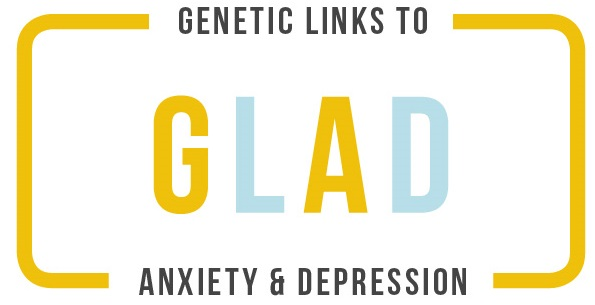

# GLAD-Medications

  

 

Analysis scripts for the medication
questionnaire in the **Genetic Links to Depression and Anxiety (GLAD)** study.

 

* `src/` contains all the source code files which do not permanently manipulated
  the data.

* `reports/` contains the Rmardkown reports.

* `lib/` contains helper function scripts.

* `munge/` contains scripts that modify the data permanently.

* `manuscripts/` contains write-ups

* `graphs/` contains saved plot.

* `docs/` contains documentation of data cleaning process and some files with
  texual information releveant to analysis.

* `diagnostics` contains scripts used to detect faulty design (e.g. recoding
  error) in the questionnaire.

* `data` contains raw dats files.

* `cache` contains user-generated R obects that will be reused.

* `config` contains setting of the `ProjectTemplate` package.

